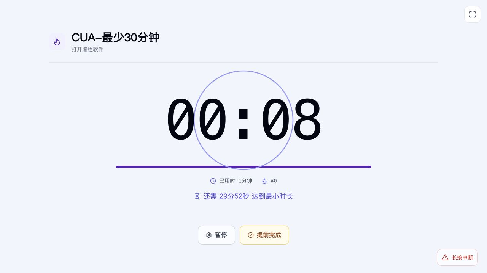
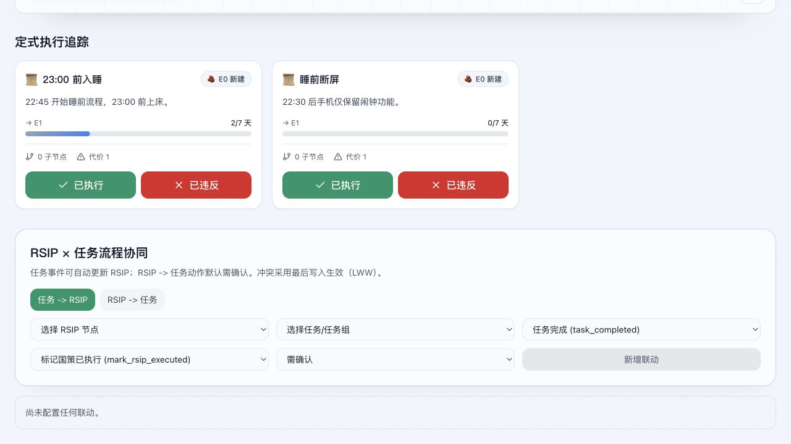
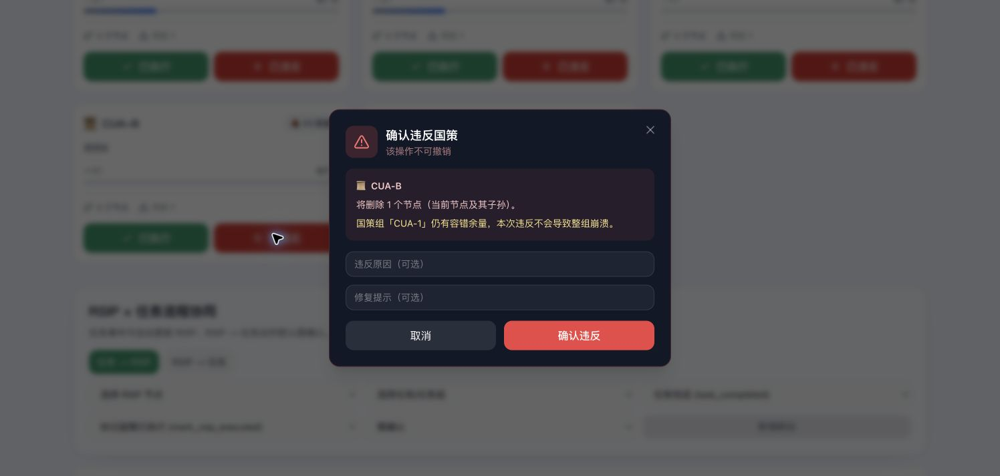
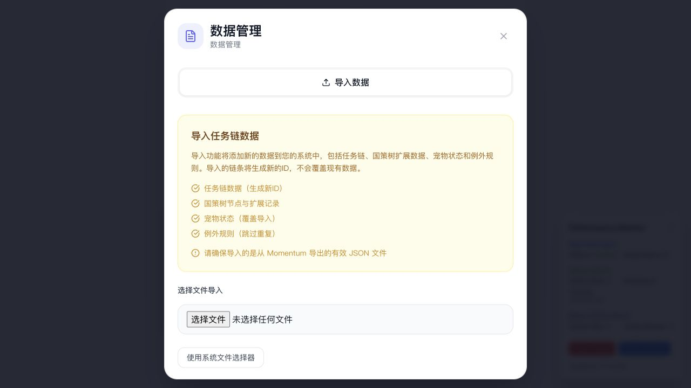

# Momentum Computer Use 功能测试报告

测试日期：2026-09-06（America/New_York）。

本次通过真实浏览器操作复现 **12 项问题：3 项 P1、7 项 P2、2 项 P3**。主要问题集中在承诺约束、预约裁决、RSIP 计数与容错，以及完成或导入后的界面状态同步。测试依据是 [MOMENTUM_FEATURES_VERIFIED.md](MOMENTUM_FEATURES_VERIFIED.md)，不是将文档中的代码推断直接当作实测结果。

## 1. 环境与方法

| 项目           | 本次情况                                                                                                                |
| -------------- | ----------------------------------------------------------------------------------------------------------------------- |
| 被测提交       | `574f5785a42b83c8a51603e950c3cecff5653276`                                                                              |
| 与文档基准差异 | 对比文档中的 `9366759`，仅新增功能说明文档，应用代码无差异                                                              |
| 启动方式       | `npm run dev -- --host 127.0.0.1 --port 5174`                                                                           |
| 被测地址       | `http://127.0.0.1:5174/`                                                                                                |
| 平台           | macOS，Web 开发模式；Node.js 20.19.0，Vite 7.3.1                                                                        |
| 浏览器         | Codex 内置浏览器为主；Google Chrome 交叉验证导入、国策组、任务群结算、回收箱等                                          |
| 视口           | 内置浏览器截图 1280×720；Chrome 截图 1496×713；未模拟手机                                                               |
| 数据源         | 无需登录的本地存储；首页明确显示签到“演示模式”                                                                          |
| 测试数据       | 独立端口下的空白环境，使用 `CUA-` 前缀任务与国策、内置作息模板、`CUA测试宠物`                                           |
| 操作方式       | Computer Use 点击、输入、滚动、选择、刷新，以及 Chrome 原生窗口操作；未修改浏览器存储、系统时间或应用运行状态来伪造结果 |
| 证据           | [截图、页面可访问性文本与实际导出文件](../reports/computer-use/2026-09-06/)                                             |

代码只用于在复现后辅助定位。本次未修改应用代码，未运行单元测试、构建或完整 CI；这些均不能替代本报告的用户操作验证。没有使用线上账户或修改线上数据。

优先级含义：P1 为核心约束或确认流程失效，建议优先修复；P2 为统计、规则边界或功能流程错误；P3 为展示和提示不准确。以下“通过”仅指列出的实际路径，不表示整项功能所有边界均已覆盖。

## 2. 问题总表

| 编号 | 级别 | 已复现问题                                       | 依据章节 |
| ---- | ---- | ------------------------------------------------ | -------- |
| B01  | P1   | 无时长任务未达到最小时长即可直接成功完成         | 2.3、6.1 |
| B02  | P2   | 一轮预约在创建和完成时各累计一次辅助链           | 2.2、6.1 |
| B03  | P1   | 预约自然过期后没有出现辅助链裁决界面             | 2.2、6.2 |
| B04  | P2   | 同一天重复执行国策可以累计多个“天”               | 4.3、6.1 |
| B05  | P2   | 严格模式允许一次批量创建两条国策                 | 4.2、6.1 |
| B06  | P2   | 国策组容错为 1，连续两次损失仍不触发整组崩塌     | 4.5、6.1 |
| B07  | P1   | 任务→国策联动配置“需确认”仍直接执行              | 5.1、6.1 |
| B08  | P2   | 仅有国策数据时没有导出入口                       | 5.5      |
| B09  | P2   | 任务群完成一轮后仍显示旧计数和旧进度，刷新才同步 | 3        |
| B10  | P2   | 导入宠物后界面仍提示领养，刷新才显示导入宠物     | 5.3、5.5 |
| B11  | P3   | 任务详情的软删除弹窗误称永久删除历史与配置       | 5.5      |
| B12  | P3   | 无时长任务在详情和群内列表显示为“0分钟”          | 2.1、2.3 |

## 3. 可复现问题详情

### B01 — 最小时长没有阻止直接完成

- **前置条件：**创建 `CUA-最少30分钟`，开启“无时长任务”，明确选择最小时长 30 分钟并保存。
- **步骤：**开始任务；页面仍显示“还需 29分52秒 达到最小时长”时，点击“提前完成”；填写描述后点击“完成任务”。
- **预期：**未达到最小时长时不能通过普通完成路径直接结算成功；若允许例外，应进入明确的例外判定流程。
- **实际：**直接打开完成信息框，无需选择任何例外规则；提交后主链变为 `#1`、完成次数变为 1、记录用时为 1 分钟。首次会话真实时间约 18 秒，历史分钟数采用向上取整。
- **影响：**最小时长只提供提示，不能形成实际约束。
- **复测：**编辑页面仍显示 30 分钟，说明本次不是配置丢失。群内副本和 Chrome 也能走同一路径。
- **定位：**`src/components/focus-mode/FocusModeContainer.tsx` 的 `handleEarlyCompleteClick()` 对无时长任务直接打开完成框。
- **证据：**[完成前页面](../reports/computer-use/2026-09-06/05-min-duration-before.txt)、[结算后页面](../reports/computer-use/2026-09-06/05-min-duration-completed.txt)、[实际导出备份](../reports/computer-use/2026-09-06/test-export.json)。

### B02 — 一轮预约重复增加辅助链

- **前置条件：**任务此前没有预约记录，主链已完成一次。
- **步骤：**点击“预约”，观察辅助链；在倒计时内点击“完成预约”；进入详情。
- **预期：**一次成功履行的预约最多增加一次辅助链记录，创建尚未履行的预约不应先记一次成功。
- **实际：**点击预约后辅助链从 0 变为 1，完成同一预约后变为 2；任务详情显示主链 `#1`、预约链 `#2`。
- **影响：**辅助链统计虚高，未完成预约也会先获得计数。
- **定位：**`src/hooks/domains/sessions/scheduling.ts` 的预约创建与完成路径都执行 `auxiliaryStreak + 1`。
- **证据：**[创建预约](../reports/computer-use/2026-09-06/06-schedule-created.txt)、[完成预约](../reports/computer-use/2026-09-06/06-schedule-completed.txt)、[详情](../reports/computer-use/2026-09-06/06-detail.txt)。

### B03 — 预约自然过期未显示裁决

- **前置条件：**将任务预约时长设为自定义 1 分钟，保存后从首页预约。
- **步骤：**看到倒计时 `00:59`；不点击完成或中断，保持页面打开直到自然过期；过期后再刷新页面检查状态。
- **预期：**出现辅助链裁决，允许判定失败或记录例外。
- **实际：**17:53:36 启动预约；17:54:42 检查时预约区域已消失，只剩“预约”按钮，没有裁决界面；辅助链仍保留本次创建时增加的 `#1`。刷新后也是该状态。
- **对照：**手动点击“中断/规则判定”会正常出现裁决；判定失败能使辅助链清零、辅助链失败数增加，主链保持不变。
- **跨浏览器复测：**Chrome 中同样等待 1 分钟预约自然过期；倒计时消失，未出现裁决，本次增加的辅助链计数仍保留。见 [Chrome 页面记录](../reports/computer-use/2026-09-06/17-chrome-schedule-expired.txt) 和 [截图](../reports/computer-use/2026-09-06/17-chrome-schedule-expired.png)。
- **影响：**超时承诺没有可见的结算出口，并与 B02 一起导致过期预约仍保留计数。
- **定位建议：**检查 `src/app/hooks/usePeriodicCleanup.ts` 设置裁决、移除预约，以及状态更新之间的衔接；本报告未将具体内部根因定论。
- **证据：**[过期状态](../reports/computer-use/2026-09-06/07-schedule-expired.txt)、[截图](../reports/computer-use/2026-09-06/07-schedule-expired.png)。
- **范围：**本次未验证声音是否实际可听、系统通知权限或后台标签页场景。

### B04 — 同日重复执行累计多个“天”

- **前置条件：**严格模式下已有作息模板国策 `23:00 前入睡`，执行进度为 `0/7 天`。
- **步骤：**点击一次“已执行”，看到 `1/7 天`；约 4 秒后再点击一次。
- **预期：**同一天重复操作不能增加第二个执行日或连续日。
- **实际：**进度变为 `2/7 天`；备份中 `cumulativeExecutionDays`、`consecutiveExecutions` 和 `totalExecutions` 都为 2，两条记录日期相同。
- **影响：**执行次数被呈现为天数，稳定阶段的按天含义失真。本次没有将节点连续点击到 E1/E2，阶段跃迁影响属于该计数逻辑的后续风险。
- **定位：**`src/hooks/domains/rsip/nodeOperations.ts` 的执行计数递增没有同日去重。
- **证据：**[页面文本](../reports/computer-use/2026-09-06/02-repeat-execution.txt)、[备份记录](../reports/computer-use/2026-09-06/test-export.json)。

### B05 — 严格模式批量新增绕过每天一条

- **前置条件：**空白国策树，选择“严格”，页面提示“每天最多新增一个国策。今日可新增”。
- **步骤：**启用拆分模式；点击“作息模板”；提交“批量创建拆分国策”。
- **预期：**该模式下所有创建入口遵守每天最多一个节点，或清楚说明并约束批量计划的生效日期。
- **实际：**一次创建 `23:00 前入睡`、`睡前断屏` 两个有效节点；随后普通新增变为禁用，提示“今日已新增，明日继续”。
- **影响：**单条新增受限，批量新增能突破相同的每日规则。
- **定位：**`src/components/rsip/hooks/useRSIPViewCreationActions.ts` 的 `handleSubmitSplit()` 只判断当日是否可新增，再一次保存全部有效条目。
- **证据：**[严格模式创建结果](../reports/computer-use/2026-09-06/01-strict-batch.txt)。

### B06 — 国策组容错不会累计消耗

- **浏览器：**Google Chrome。
- **前置条件：**新建国策组 `CUA-1`，容错为 1；自由模式下创建同组的 `CUA-A`、`CUA-B`、`CUA-C` 三个根节点；然后切回严格模式显示执行追踪。
- **步骤：**对 A 点击“已违反”并确认；再对 B 点击“已违反”，查看提示并确认。
- **预期：**按“最多允许损失一个成员”的语义，第一次损失可容忍，第二次应超过额度并触发整组处理。
- **实际：**第二次弹窗仍写“仍有容错余量，本次违反不会导致整组崩溃”；确认后 A、B 已移除，C 仍存活。
- **影响：**容错值 1 无法表达累计只允许一次成员损失。
- **定位：**`src/hooks/domains/rsip/nodeOperations.ts` 每次以当前存活成员数计算阈值，没有固定基数或累计消耗状态。
- **证据：**[三个成员与容错设置](../reports/computer-use/2026-09-06/13-tolerance-before.txt)、[第二次违规提示](../reports/computer-use/2026-09-06/13-tolerance-second.txt)、[最终剩余成员](../reports/computer-use/2026-09-06/13-tolerance-after.txt)。

### B07 — “需确认”联动未请求确认

- **前置条件：**`睡前断屏` 执行进度为 `0/7 天`；新增任务→RSIP 联动：`CUA-最少30分钟`、任务完成、标记国策已执行、需确认，并保持启用。
- **步骤：**完成该任务；观察完成后的页面，再进入国策树。
- **预期：**对国策变更请求独立确认；用户未确认时不增加国策执行记录。
- **实际：**任务结算后直接返回首页，没有联动确认；国策已变为 `1/7 天`，配置仍显示“需确认”。第二次完成后变为 `2/7 天`。
- **影响：**用户选择的自动化权限不生效。实际复现的是“标记已执行”；“标记已违反”方向的风险不能视为本次也已实测。
- **定位：**`src/hooks/domains/rsip/taskLinkOperations.ts` 的任务事件处理直接调用国策更新；导出配置可见 `automation: "confirm"`。
- **证据：**[联动配置及变更前](../reports/computer-use/2026-09-06/04-link-before.txt)、[变更后](../reports/computer-use/2026-09-06/04-link-after.txt)、[截图](../reports/computer-use/2026-09-06/04-link-after.png)。

### B08 — 只有国策数据时无法导出

- **前置条件：**已创建两条国策并记录执行，尚未创建任何任务链。
- **步骤：**返回首页，打开“数据管理”。
- **预期：**既然 JSON 3.0 支持 RSIP 等数据，没有任务链也能备份已存在的数据。
- **实际：**对话框只有导入区域，没有“导出数据”页签或导出按钮；创建任务链后导出入口出现。
- **影响：**仅使用 RSIP 的用户不能通过正常入口备份；需要人为创建任务链绕过。
- **定位：**`src/components/ImportExportModalView.tsx` 将导出视图与 `chainsCount > 0` 绑定。
- **与参考文档的细微差异：**实际主入口表现为导出页签被隐藏，不只是导出按钮禁用。
- **证据：**[页面文本](../reports/computer-use/2026-09-06/03-rsip-only-export.txt)。

### B09 — 群结算后界面与刷新后状态不一致

- **前置条件：**创建 `CUA-任务群`，复制已有任务进入，设置单元重复次数为 2。
- **步骤：**完成两次子任务，观察首页和群详情；在 Chrome 导入该测试备份后，再完成第二轮剩余的一次，观察首页，然后刷新。
- **预期：**群完成计数及周期进度在结算成功后立即与保存结果保持一致。
- **实际：**首次完成后首页显示 `2/2`，群记录仍为 0；群详情显示 `100%`、`2/2 重复次数`。Chrome 复测第二轮完成后显示群记录 `#1`、进度 `2/2`；刷新后变为群记录 `#2`、进度 `0/2`、第 3 轮进行中。
- **结论：**这是已复现的界面状态同步错误；不能据此声称群完成次数永久丢失。开始新一轮或刷新会暴露已经变化的计数。
- **影响：**用户无法准确判断当前轮次是否已结算，以及“开始下一个”对应哪一轮。
- **定位建议：**检查 `completionState.ts`、`completion.ts`、`groupStartFlow.ts` 与任务树缓存、渲染数据之间的一致性，根因尚未定论。
- **证据：**[首次完成首页](../reports/computer-use/2026-09-06/09-group-cycle.txt)、[群详情](../reports/computer-use/2026-09-06/09-group-cycle-detail.txt)、[Chrome 刷新前](../reports/computer-use/2026-09-06/14-group-chrome-before-reload.txt)、[刷新后](../reports/computer-use/2026-09-06/14-group-chrome-after-reload.txt)。

### B10 — 导入宠物后需刷新才更新界面

- **前置条件：**备份含 `CUA测试宠物`；Chrome 空白本地环境中选择“稍后再说”，没有现有宠物。
- **步骤：**数据管理中粘贴实际导出的 JSON，勾选保留统计和原始时间戳，导入成功后回到首页；随后刷新。
- **预期：**导入成功即显示恢复的宠物状态。
- **实际：**任务和群已出现，但宠物区域仍为“领养宠物／给新伙伴起个名字”；刷新后才出现导入的小鸡及“展开宠物”按钮。
- **影响：**用户可能误以为宠物未导入。没有证据表明宠物持久化数据丢失。
- **定位建议：**核对导入持久化与 `src/hooks/domains/usePetDomain.ts` 的独立 React 状态刷新机制。
- **证据：**[导入后未刷新](../reports/computer-use/2026-09-06/12-import-before-refresh.txt)、[刷新后](../reports/computer-use/2026-09-06/12-import-after-refresh.txt)、[备份](../reports/computer-use/2026-09-06/test-export.json)。

### B11 — 软删除被提示为永久删除

- **步骤：**打开有 2 次完成历史的任务详情，点击“删除”，查看弹窗；确认删除后进入回收箱并恢复。
- **预期：**明确说明任务会进入回收箱，以及恢复和保留期限。
- **实际：**弹窗写“此操作将永久删除以下数据”，列出历史、时间统计、规则与配置；但任务实际进入回收箱，显示 30 天后才永久删除。恢复后主链 `#2`、总完成 2、两条历史和中文备注均保留。
- **影响：**用户会误判删除不可恢复；与实际回收箱语义冲突。
- **定位：**`src/components/chain-detail/DeleteConfirmModal.tsx`；实际处理通过 `src/services/realTimeSyncOperations.ts` 调用 `softDeleteChain()`。
- **证据：**[误导文字](../reports/computer-use/2026-09-06/15-delete-wording.txt)、[恢复后的详情](../reports/computer-use/2026-09-06/15-restored-detail.txt)。

### B12 — 无时长任务显示为 0 分钟

- **前置条件：**无时长任务配置最小时长 30 分钟，已成功保存。
- **步骤：**查看任务详情、导入单元列表和群内副本列表。
- **预期：**显示“无固定时长”，并能区分最小时长与实际用时。
- **实际：**这些界面显示“任务时长 0分钟”或“0分钟”；专注页面和编辑器则能显示最小时长 30 分钟。
- **影响：**用户难以判断这是无时长配置、数据未保存，还是零时长任务。
- **定位：**例如 `src/components/chain-detail/ChainDetailStats.tsx` 直接格式化 `chain.duration`，未单独表达无时长语义。
- **证据：**[任务详情](../reports/computer-use/2026-09-06/06-detail.txt)、[群内列表](../reports/computer-use/2026-09-06/09-group-cycle-detail.txt)。

## 4. 覆盖结果

| 流程                   | 结果     | 本次观察                                                                   |
| ---------------------- | -------- | -------------------------------------------------------------------------- |
| 空白环境本地启动       | 通过     | 无需 Supabase 登录即可创建和保存核心数据                                   |
| 创建、编辑任务         | 通过     | 名称、触发动作、任务描述、预约条件可以保存                                 |
| 无时长与最小时长保存   | 部分通过 | 30 分钟保存后可重新读出；完成拦截失败，见 B01                              |
| 任务详情与中文历史     | 通过     | 描述和备注通过文字输入保存并显示；不是中文 IME 组合输入测试                |
| 成功结算               | 通过     | 主链与完成次数递增，历史保存                                               |
| 创建预约、手动完成     | 失败     | 倒计时正常，辅助链重复累计，见 B02                                         |
| 手动预约失败裁决       | 通过     | 有弹窗；辅助链归零、失败数增加，主链不变                                   |
| 自然预约过期裁决       | 失败     | 无弹窗，见 B03                                                             |
| 暂停规则、自动恢复     | 通过     | 使用 Bathroom break，暂停一分钟；用时保持在 00:07，自动恢复后继续到 00:14  |
| 全屏进入和退出         | 通过     | 控件在进入、退出状态间切换                                                 |
| 定时提前完成规则分类   | 通过     | 提前完成只显示 Reached goal early；暂停流程显示 Bathroom break、Phone call |
| 定时任务自然完成       | 通过     | 1 分钟倒计时自然到点后弹出完成框，提交后主链为 1、完成次数为 1             |
| 任务另存为副本         | 通过     | 创建独立定时测试任务，原任务保留                                           |
| 任务群创建、复制、重复 | 部分通过 | 副本新 ID、统计清零，重复 2 次计数推进；群结算显示见 B09                   |
| 普通创建国策、父子关系 | 通过     | 根节点与子节点可创建；根节点显示 1 个子节点                                |
| 模板、严格模式新增     | 失败     | 批量入口突破每日上限，见 B05                                               |
| 执行统计               | 失败     | 同日多次按天累计，见 B04                                                   |
| 国策组创建             | 通过     | Chrome 原生提示框可创建容错组                                              |
| 国策组容错             | 失败     | 连续两次损失仍保留第三个成员，见 B06                                       |
| 违反根节点、国策库归档 | 通过     | 根与子节点一起移除，两条归档均出现                                         |
| 国策恢复               | 通过     | 恢复根节点后活跃节点增加，规则保留                                         |
| 轮次历史、洞察         | 通过     | 可查看崩塌原因、峰值节点 4、活跃数与成功率等                               |
| 任务→国策联动          | 部分通过 | 联动确实执行，但忽略需确认选项，见 B07                                     |
| 宠物领养、喂食、最小化 | 通过     | 饱食从 50 变 80、快乐从 70 变 75，任务后获得经验和形态反馈                 |
| JSON 导出              | 部分通过 | 有任务时生成实际 JSON 3.0 文件；仅有国策时见 B08                           |
| 有效备份导入           | 部分通过 | 任务生成新 ID、群父子关系及历史和联动可显示；宠物即时状态见 B10            |
| 无效 JSON 导入         | 通过     | 明确提示格式错误，未添加数据                                               |
| 任务回收箱与恢复       | 通过     | 软删除后可恢复统计及历史；删除提示问题见 B11                               |
| 页面刷新后的本地保存   | 通过     | 任务、国策、历史、联动和宠物可恢复读取                                     |

定时自然结束的证据：[自动出现的完成框](../reports/computer-use/2026-09-06/16-timed-natural-completion.txt)、[提交后的任务统计](../reports/computer-use/2026-09-06/16-timed-result.txt)。

## 5. 未验证范围与环境限制

- **云端登录、跨设备同步、真实签到与押注：**未配置测试账号或 Supabase；首页签到是明确标识的演示，不当成真实积分功能通过，也不误报本地不支持押注为 bug。
- **中文输入法问题：**中文字符串输入、保存、历史显示通过，但未用真实拼音输入法验证 compositionstart/compositionend 与候选词回车，因此不能排除文档引用的中文 IME 问题。
- **手机触控、Android Edge、iOS、Tauri：**未测试真机、安装包、移动滚动、原生文件导出、通知与应用更新；桌面浏览器结论不外推。
- **主链主动中断：**尝试普通点击与键盘回车，未完成“长按中断”要求，故未验证主链失败结算，也不把普通点击无效果视为 bug。
- **其余边界：**跨日连续天数、RSIP E1/E2 升级与强化保护、国策→任务反向联动、任务群移动/重排/群重复次数/时间限制过期、任意深度嵌套、手动新建例外、通知授权、主题和语言切换、离线 PWA、永久删除均未完成验证。
- **原生 prompt：**内置浏览器的新建国策组返回 `prompt() is not supported`；Chrome 的页面自动化在原生弹窗时超时，随后通过 Computer Use 原生窗口填写成功。这是环境与工具限制，不计入上面的 12 项缺陷。
- **开发环境浮层：**Performance Monitor 是本次开发模式可见内容，没有据此推断生产环境也存在该浮层。

## 6. 建议修复和回归顺序

1. 优先修复 B01、B03、B07，保证最小时长、过期裁决与用户确认真正生效。
2. 修复 B02、B04、B05、B06，并分别回归一次预约、同日重复执行、全部新增入口和累计容错。
3. 修复 B09、B10 的保存结果与界面状态同步；回归时必须在不刷新的情况下验证，随后刷新做一致性对照。
4. 修复 B08、B11、B12 的备份入口和提示；补齐仅使用 RSIP、仅有宠物、无时长任务等非默认使用路径。

报告保留了实际生成的测试备份与截图。浏览器中的测试数据是本次新建数据，可用于后续复测；没有执行永久清理。
